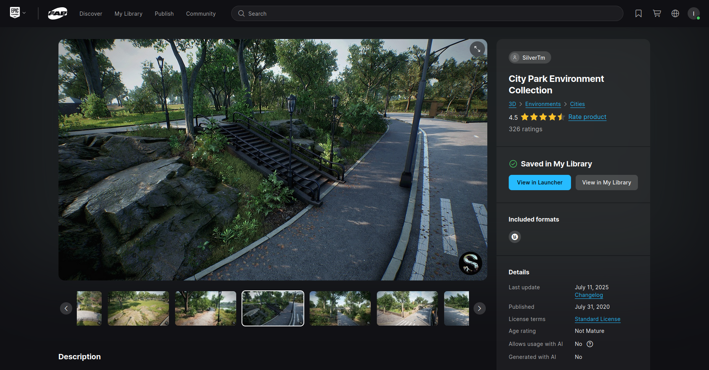

# Simulation Setup

This project uses [Microsoft AirSim](https://microsoft.github.io/AirSim/) for simulation.  
To ensure everything runs smoothly, please follow the official AirSim installation guidelines for Windows.

## Installation Instructions

This setup is for Windows only.

### Create an Epic Games Account
Before installing Unreal Engine, you need an Epic Games account. Visit [https://www.epicgames.com/id/register](https://www.epicgames.com/id/register) to create one if you don't have it already.

### Install Unreal Engine 4.27
Follow the official instructions at [https://dev.epicgames.com/documentation/en-us/unreal-engine/installing-unreal-engine?application_version=4.27](https://dev.epicgames.com/documentation/en-us/unreal-engine/installing-unreal-engine?application_version=4.27).

Key steps:
- Download and install the Epic Games Launcher from [https://www.epicgames.com/store/download](https://www.epicgames.com/store/download).
- Sign in with your Epic Games account.
- In the Launcher, go to the "Unreal Engine" tab.
- Select "Library" andcentral click the "+" button to add Engine versions.
- Choose version 4.27.2 and install it.
- System requirements: Windows 10 (64-bit), Quad-core Intel or AMD (2.5 GHz or faster), 8 GB RAM, NVIDIA GeForce GTX 470 or AMD Radeon 6870 HD series or higher, DirectX 11 or 12 compatible graphics card.

### Install Git on Windows
Git is required for cloning the AirSim repository.
- Download the latest installer from [https://git-scm.com/download/win](https://git-scm.com/download/win).
- Run the installer and follow the on-screen instructions. Use default options unless you have specific preferences (e.g., add Git to PATH).
- Verify installation by opening Command Prompt and running `git --version`.

### Enable Windows Subsystem for Linux (WSL)
WSL is needed for certain build processes.
- Open PowerShell as Administrator (right-click Start menu > Windows PowerShell (Admin)).
- Run the command: `wsl --install`.
- This will enable WSL and install the default Linux distribution (Ubuntu).
- For first-time installation, restart your PC when prompted: Close all apps, then go to Start > Power & sleep > Restart.
- After reboot, open PowerShell again and run `wsl` to complete the setup (it may prompt for a username and password for the Linux distro).

3. Once installed, verify the setup by running a sample environment.

## Build AirSim

- Install Visual Studio 2022. Download from [https://visualstudio.microsoft.com/downloads/](https://visualstudio.microsoft.com/downloads/). Make sure to select "Desktop Development with C++" and "Windows 10 SDK 10.0.19041" (should be selected by default). Also, select the latest .NET Framework SDK under the 'Individual Components' tab.
- Start "Developer Command Prompt for VS 2022" (search in Start menu).
- Clone the repo: `git clone https://github.com/Microsoft/AirSim.git`, and go to the AirSim directory by `cd AirSim`.
- Note: It's generally not a good idea to install AirSim in C drive. This can cause scripts to fail and requires running VS in Admin mode. Instead, clone in a different drive such as D or E.
- Run `build.cmd` from the command line. This will create ready-to-use plugin bits in the `Unreal\Plugins` folder that can be dropped into any Unreal project.

## Build Unreal Project

You will need an Unreal project that hosts the environment for your vehicles. Make sure to close and re-open the Unreal Engine and the Epic Games Launcher before building your first environment if you haven't done so already. After restarting the Epic Games Launcher, it will ask you to associate project file extensions with Unreal Engine; click on 'fix now' to fix it. AirSim comes with a built-in "Blocks Environment" which you can use, or you can create your own. Please see setting up Unreal Environment.

## Creating and Setting Up Unreal Environment

The Unreal Marketplace offers several environments that you can start using in just a few minutes. You can also use environments from websites like [turbosquid.com](https://www.turbosquid.com) or [cgtrader.com](https://www.cgtrader.com) with a bit more effort (see [tutorial video](https://www.youtube.com/watch?v=example)). Additionally, there are several free environments available.

Below, we will use a freely downloadable environment from Unreal Marketplace called City Park Environment Collection, but the steps are the same for any other environment.

### Step by Step Instructions

- Ensure AirSim is built and Unreal 4.27 is installed as described in the build instructions.
- In Epic Games Launcher, click the "Unreal Engine" tab, then "Marketplace". Search for "City Park Environment Collection". Click "Free" to add it to your library, then "Create Project" and download this content (~ size may vary, around 2GB or more based on assets).

<!-- Space for image: City Park Environment Collection -->


- Open `CityParkEnvironmentCollection.uproject`; it should launch the Unreal Editor.

<!-- Space for image: unreal editor -->

**Note**: The CityParkEnvironmentCollection project is supported up to certain Unreal Engine versions. If you do not have a compatible version installed, you should see a dialog titled "Select Unreal Engine Version" with a dropdown to select from installed versions. Select 4.27 to migrate the project. If needed, manually migrate by navigating to the .uproject file in Windows Explorer, right-clicking it, and selecting "Switch Unreal Engine version...".

- From the File menu, select "New C++ class", leave default "None" on the type of class, click Next, leave default name "MyClass", and click "Create Class". This is required because Unreal needs at least one source file in the project. It should trigger a compile and open the Visual Studio solution `CityParkEnvironmentCollection.sln`.
- Go to your AirSim repo folder and copy the `Unreal\Plugins` folder into your `CityParkEnvironmentCollection` folder. This integrates the AirSim plugin into your Unreal project.

**Note**: If the AirSim installation is fresh (i.e., hasn't been built before), run `build.cmd` from the root directory once before copying the `Unreal\Plugins` folder to include AirLib files. If you have made changes in the Blocks environment, run `update_to_git.bat` from `Unreal\Environments\Blocks` to update the files in `Unreal\Plugins`.

- Edit the `CityParkEnvironmentCollection.uproject` to look like this:

```
{
    "FileVersion": 3,
    "EngineAssociation": "4.27",
    "Category": "Samples",
    "Description": "",
    "Modules": [
        {
            "Name": "CityParkEnvironmentCollection",
            "Type": "Runtime",
            "LoadingPhase": "Default",
            "AdditionalDependencies": [
                "AirSim"
            ]
        }
    ],
    "TargetPlatforms": [
        "WindowsNoEditor"
    ],
    "Plugins": [
        {
            "Name": "AirSim",
            "Enabled": true
        }
    ]
}
```

- Edit the `Config\DefaultGame.ini` to add the following line at the end:

```
+MapsToCook=(FilePath="/AirSim/AirSimAssets")
```

This ensures Unreal includes all necessary AirSim content in packaged builds of your project.

- Close Visual Studio and the Unreal Editor, then right-click the `CityParkEnvironmentCollection.uproject` in Windows Explorer and select "Generate Visual Studio Project Files". This detects all plugins and source files in your Unreal project and generates the `.sln` file for Visual Studio.

<!-- Space for image: regen -->

**Tip**: If the "Generate Visual Studio Project Files" option is missing, reboot your machine for the Unreal Shell extensions to take effect. If it’s still missing, open the `CityParkEnvironmentCollection.uproject` in the Unreal Editor and select "Refresh Visual Studio Project" from the File menu.

- Reopen `CityParkEnvironmentCollection.sln` in Visual Studio, and ensure "DebugGame Editor" and "Win64" build configuration is the active build configuration.

<!-- Space for image: build config -->

- Press F5 to run. This will start the Unreal Editor, where you can edit the environment, assets, and other game-related settings. First, set up the `PlayerStart` object. In the CityParkEnvironmentCollection environment, if a `PlayerStart` object exists, find it in the World Outliner. Ensure its location is set appropriately. This is where the AirSim plugin will create and place the vehicle. If it’s too high, the vehicle may fall when you press play, causing unpredictable behavior.

<!-- Space for image: player_start_pos.png -->

- In Window/World Settings, set the GameMode Override to `AirSimGameMode`:

<!-- Space for image: sim_game_mode.png -->

- Go to 'Edit->Editor Preferences' in Unreal Editor, search for 'CPU', and ensure 'Use Less CPU when in Background' is unchecked. Otherwise, Unreal will slow down significantly when the window loses focus.
- Save these edits, then hit the Play button in the Unreal Editor. See how to use AirSim.

**Congratulations!** You are now running AirSim in your own Unreal environment.

## PX4 Software-in-the-Loop (SITL) with WSL 2

The Windows Subsystem for Linux version 2 (WSL 2) runs in a virtual machine with a separate IP address from your Windows host machine. This means PX4 cannot connect to AirSim using "localhost," which is the default behavior.

Run `ipconfig` in Command Prompt to identify the WSL Ethernet adapter. Look for an entry like:

```
Ethernet adapter vEthernet (WSL):

   Connection-specific DNS Suffix  . :
   Link-local IPv6 Address . . . . . : fe80::1192:f9a5:df88:53ba%44
   IPv4 Address. . . . . . . . . . . : 172.31.64.1
   Subnet Mask . . . . . . . . . . . : 255.255.240.0
   Default Gateway . . . . . . . . . :
```

The address `172.31.64.1` is what WSL 2 uses to reach your Windows host machine. Update this address based on your `ipconfig` output.

Starting with PX4 version v1.12.0-beta1 or newer (see [PX4 Change Request](https://github.com/PX4/PX4-Autopilot/pull/12345)), PX4 in SITL mode can connect to AirSim on a remote IP address. To enable this:
- Ensure you have a PX4 version that includes this fix.
- In your WSL Linux environment, set the environment variable:

```bash
export PX4_SIM_HOST_ADDR=172.31.64.1
```

Replace `172.31.64.1` with the IPv4 address from your `ipconfig` output.

- Open incoming TCP port 4560 and UDP port 14540 in your Windows firewall settings to allow communication.
- In WSL, run `ip address show` and note the `eth0 inet` address (e.g., `172.31.66.156`). This is the address Windows needs to communicate with PX4.
- Edit your AirSim settings file (typically `~/Documents/AirSim/settings.json`) to include the `LocalHostIp` and `ControlIp` settings:

```
{
    "SettingsVersion": 1.2,
    "SimMode": "Multirotor",
    "ClockType": "SteppableClock",
    "Vehicles": {
        "PX4": {
            "VehicleType": "PX4Multirotor",
            "UseSerial": false,
            "LockStep": true,
            "UseTcp": true,
            "TcpPort": 4560,
            "ControlIp": "remote",
            "ControlPortLocal": 14540,
            "ControlPortRemote": 14580,
            "LocalHostIp": "172.31.64.1",
            "Sensors": {
                "Barometer": {
                    "SensorType": 1,
                    "Enabled": true,
                    "PressureFactorSigma": 0.0001825
                }
            },
            "Parameters": {
                "NAV_RCL_ACT": 0,
                "NAV_DLL_ACT": 0,
                "COM_OBL_ACT": 1,
                "LPE_LAT": 47.641468,
                "LPE_LON": -122.140165
            }
        }
    }
}
```

The `LocalHostIp` tells AirSim to use the WSL Ethernet adapter address instead of localhost, and `ControlIp` set to `"remote"` resolves to the WSL 2 remote IP address. The `Barometer` setting reduces noise in the AirSim barometer to ensure PX4 compatibility. See [PX4 LockStep](https://microsoft.github.io/AirSim/px4_sitl/) for more details.

If your PX4 version does not include the remote IP fix, edit the file `ROMFS/px4fmu_common/init.d-posix/rcS` in your PX4 repository to include:

```bash
# If PX4_SIM_HOST_ADDR environment variable is empty, use localhost.
if [ -z "${PX4_SIM_HOST_ADDR}" ]; then
    echo "PX4 SIM HOST: localhost"
    simulator start -c $simulator_tcp_port
else
    echo "PX4 SIM HOST: $PX4_SIM_HOST_ADDR"
    simulator start -t $PX4_SIM_HOST_ADDR $simulator_tcp_port
fi
```

**Note**: This code may already exist depending on your PX4 version.

When starting the simulation, be patient for the message:

```
INFO  [simulator] Simulator connected on TCP port 4560.
```

Remote connections may take longer to establish than localhost.

Now, proceed with the steps in [Setting up PX4 Software-in-the-Loop](https://microsoft.github.io/AirSim/px4_sitl/).

## Project Integration

- After setting up AirSim, you can integrate it with this project’s simulation modules.  
- Ensure that AirSim is running before starting any client or server scripts.  

## Notes

- Use the **same AirSim version** as specified in the project dependencies (check `requirements.txt` or documentation).
- For troubleshooting, refer to the official [AirSim Issues Page](https://github.com/microsoft/AirSim/issues).  

---

✅ Please ensure you have AirSim correctly installed before running any simulation scripts in this directory.
